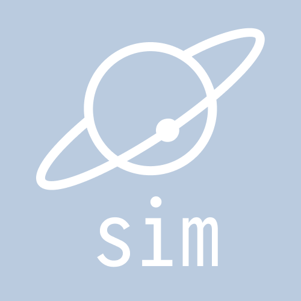

# sim



## building from source

you need rust and cargo installed, preferably via `rustup`:

```bash
curl --proto '=https' --tlsv1.2 -sSf https://sh.rustup.rs | sh
# follow the on-screen instructions, then ensure the stable toolchain is default:
rustup default stable
```

## agent screenshots

render a deterministic game frame directly to a PNG and exit:

```bash
cargo run -- --seed 42 --start playing --ticks 300 \
  --screenshot target/agent-captures/game.png --width 800 --height 600
```

the capture uses the native wgpu and egui renderers, advances the simulation by
the requested number of fixed ticks, and does not depend on browser rendering.
use `--start main-menu` without `--ticks` to capture the main menu. run
`cargo run -- --help` for all options.
